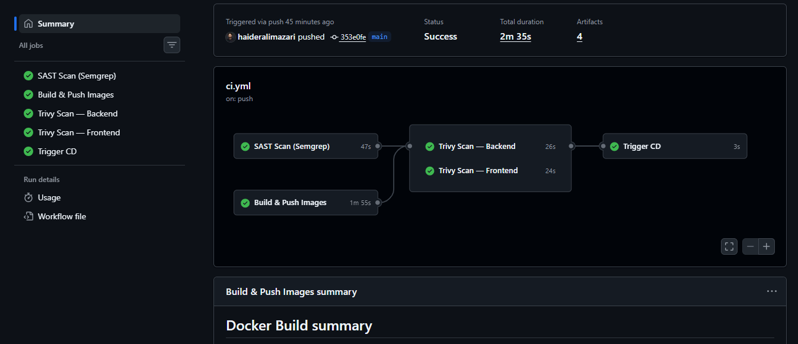
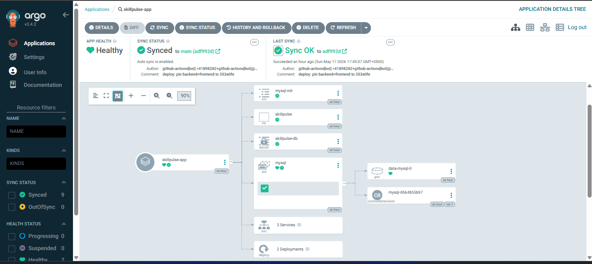
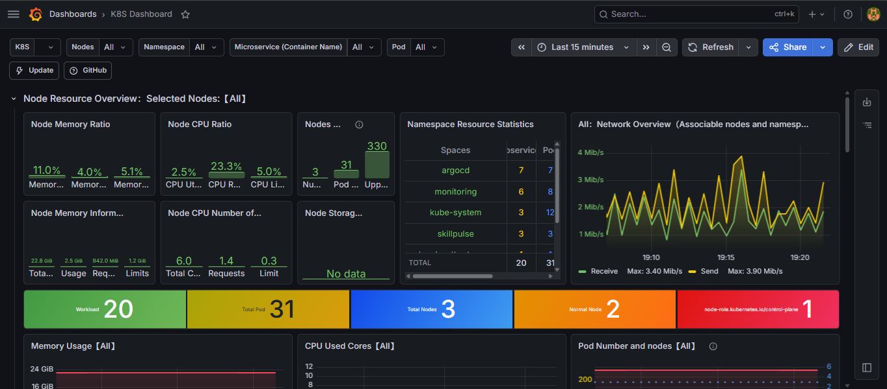
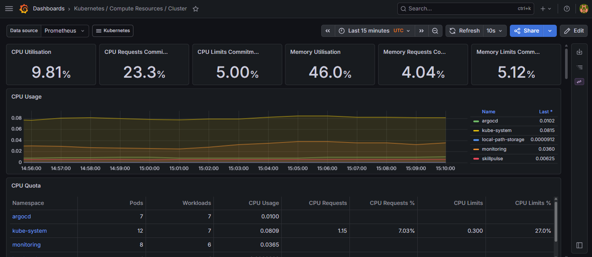
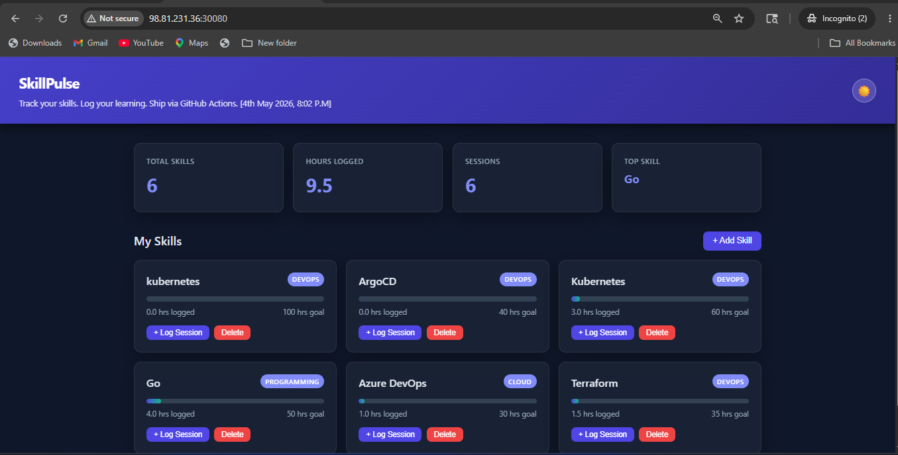

# SkillPulse — Production-Grade DevSecOps & GitOps Automation Platform

> A fully automated, security-hardened, cloud-native deployment platform built on Kubernetes, GitHub Actions, ArgoCD, and Prometheus/Grafana observability stack.

---

## 📌 Overview

SkillPulse is a production-ready **3-tier full-stack application** (Frontend → Flask Backend → MySQL Database) engineered with a complete modern DevOps lifecycle across three core domains:

- **Continuous Integration** — security-first, shift-left scanning before any image hits production
- **Continuous Delivery** — declarative GitOps via ArgoCD, zero manual kubectl
- **Continuous Observability** — real-time telemetry via Prometheus & Grafana dashboards

---

## 🏗️ Architecture

```
┌─────────────────────────────────────────────────────────────┐
│                        GitHub Actions                        │
│                                                             │
│  push → main                                                │
│       ├── SAST Scan (Semgrep)     ──┐                      │
│       └── Build & Push Images    ──┼──► Trivy Backend  ──┐ │
│                                    └──► Trivy Frontend ──┼─┤
│                                                          └─► Trigger CD │
└─────────────────────────────────────────────────────────────┘
                                │
                    repository_dispatch (ci-success)
                                │
┌─────────────────────────────────────────────────────────────┐
│                      CD — GitOps                            │
│   Bump k8s manifests → commit SHA → push to main           │
└─────────────────────────────────────────────────────────────┘
                                │
                        ArgoCD detects diff
                                │
┌─────────────────────────────────────────────────────────────┐
│              Kind Cluster (1 master + 2 workers)            │
│                                                             │
│   frontend (NodePort 30080)   backend (Flask)   MySQL       │
│                    │                                        │
│         Prometheus scrape ──► Grafana dashboards            │
└─────────────────────────────────────────────────────────────┘
```

---

## 🔐 CI Pipeline — DevSecOps (Shift-Left)

### Jobs

| Job | Runs | Purpose |
|-----|------|---------|
| `SAST Scan (Semgrep)` | parallel | Source code vulnerability scan — OWASP Top 10, secrets detection |
| `Build & Push Images` | parallel | Docker build → tar artifact → DockerHub push |
| `Trivy Scan — Backend` | after build | CVE scan against global registries, CRITICAL/HIGH block |
| `Trivy Scan — Frontend` | after build | CVE scan against global registries, CRITICAL/HIGH block |
| `Trigger CD` | after all pass | `repository_dispatch` → CD workflow |

### Security Gates

- SAST scan with `p/default`, `p/owasp-top-ten`, `p/secrets` rulesets
- Container image scanning — exits with code `1` on CRITICAL or HIGH CVEs
- All SARIF reports uploaded to GitHub Security → Code Scanning tab
- CD trigger fires **only** when all 5 jobs pass — no exceptions

### Image Tagging Strategy

```
docker.io/<user>/skillpulse-backend:<full-commit-sha>
docker.io/<user>/skillpulse-backend:latest

docker.io/<user>/skillpulse-frontend:<full-commit-sha>
docker.io/<user>/skillpulse-frontend:latest
```

---

## 🚀 CD Pipeline — GitOps

CD is driven entirely by manifest diffs in Git — no imperative `kubectl apply` commands.

### Flow

```
CI passes → repository_dispatch (ci-success + SHA payload)
         → CD workflow validates SHA (strict 40-char hex)
         → sed pins image tags in k8s/20-backend.yaml + k8s/30-frontend.yaml
         → git commit + push (3-retry rebase loop for race safety)
         → ArgoCD detects diff → syncs cluster to new state
```

### Self-Healing

ArgoCD continuously reconciles live cluster state against Git. Any manual change, config drift, or ad-hoc resource modification is automatically detected and reverted — enforcing immutable infrastructure.

---

## ☸️ Kubernetes Cluster

### Topology

```
Kind Cluster
├── control-plane (1 node)
├── worker-1
└── worker-2
```

### Workloads

| Component | Type | Notes |
|-----------|------|-------|
| Frontend — React/Nginx (Tier 1) | Deployment | NodePort `30080` for external access |
| Backend — Flask API (Tier 2) | Deployment | Internal ClusterIP |
| Database — MySQL (Tier 3) | StatefulSet | PersistentVolumeClaim for state durability |

---

## 📊 Observability Stack

### Prometheus

- Native scraping of container runtimes and node metrics
- Hardware resource state monitoring
- Custom scrape configs per namespace

### Grafana

| Dashboard | Tracks |
|-----------|--------|
| Cluster Infrastructure | Node health, CPU/memory per worker |
| Resource Allocation | Namespace-level compute quotas |
| Network Ingress | Live traffic spikes, request rates |

---

## 🔑 Required GitHub Secrets & Variables

### Secrets (`Settings → Secrets and variables → Actions → Secrets`)

| Secret | Required | Description |
|--------|----------|-------------|
| `DOCKERHUB_USERNAME` | ✅ | DockerHub account username |
| `DOCKERHUB_TOKEN` | ✅ | DockerHub Access Token (not password) |
| `SEMGREP_APP_TOKEN` | ✅ | Semgrep Cloud Platform API token |
| `SEMGREP_DEPLOYMENT_ID` | ✅ | Semgrep org numeric ID |
| `GH_BOT_PAT` | Optional | Fine-grained PAT — only if branch protection is enabled |

### Variables (`Settings → Secrets and variables → Actions → Variables`)

| Variable | Value | Description |
|----------|-------|-------------|
| `DEPLOY_ENABLED` | `true` | Master switch — enables image push and CD dispatch |

---

## 📁 Repository Structure

```
skillpulse/
├── .github/
│   └── workflows/
│       ├── ci.yml          # CI — build, scan, push
│       └── cd-gitops.yml   # CD — manifest bump, ArgoCD sync
├── backend/
│   ├── Dockerfile
│   └── app.py              # Flask API
├── frontend/
│   ├── Dockerfile
│   └── src/
├── k8s/
│   ├── 00-namespace.yaml
│   ├── 10-mysql.yaml       # StatefulSet + PVC
│   ├── 20-backend.yaml     # Deployment (SHA-pinned image)
│   ├── 30-frontend.yaml    # Deployment + NodePort Service
│   └── 40-monitoring.yaml  # Prometheus + Grafana
└── screenshot/
    ├── github_pipeline.png
    ├── argocd.png
    ├── K8s.png
    ├── cluster_compute.png
    └── weblive.png
```

---

## 📸 Visual Evidence

### CI/CD Pipeline


### ArgoCD Sync State


### Grafana — Cluster Infrastructure


### Grafana — Resource Allocation


### Live Application


---

## ⚙️ Local Setup

### Prerequisites

```bash
# System packages
sudo apt-get update && sudo apt-get install -y \
  curl apt-transport-https gnupg lsb-release docker.io

# Trivy
wget -qO - https://aquasecurity.github.io/trivy-repo/deb/public.key \
  | gpg --dearmor \
  | sudo tee /usr/share/keyrings/trivy.gpg > /dev/null

echo "deb [signed-by=/usr/share/keyrings/trivy.gpg] \
  https://aquasecurity.github.io/trivy-repo/deb \
  $(lsb_release -sc) main" \
  | sudo tee /etc/apt/sources.list.d/trivy.list

sudo apt-get update && sudo apt-get install trivy -y

# Semgrep
pip install semgrep

# Kind
curl -Lo ./kind https://kind.sigs.k8s.io/dl/latest/kind-linux-amd64
chmod +x ./kind && sudo mv ./kind /usr/local/bin/kind

# ArgoCD CLI
curl -sSL -o argocd https://github.com/argoproj/argo-cd/releases/latest/download/argocd-linux-amd64
chmod +x argocd && sudo mv argocd /usr/local/bin/
```

### Cluster Bootstrap

```bash
# Create Kind cluster
kind create cluster --config k8s/kind-config.yaml

# Install ArgoCD
kubectl create namespace argocd
kubectl apply -n argocd -f https://raw.githubusercontent.com/argoproj/argo-cd/stable/manifests/install.yaml

# Register repo and create ArgoCD app
argocd repo add https://github.com/<your-username>/skillpulse
argocd app create skillpulse \
  --repo https://github.com/<your-username>/skillpulse \
  --path k8s \
  --dest-server https://kubernetes.default.svc \
  --dest-namespace skillpulse \
  --sync-policy automated \
  --self-heal

# Access app
kubectl get svc -n skillpulse
# Open http://localhost:30080
```

---

## 🛡️ Security Design Decisions

- **Shift-left scanning** — vulnerabilities caught at source level before any image is built
- **SHA pinning** — `:latest` tags never used in production manifests; every deploy is traceable to an exact commit
- **No secrets in manifests** — all credentials via GitHub Secrets, Kubernetes Secrets managed separately
- **Least privilege** — GitHub Actions permissions scoped per job (`contents: read/write`, `security-events: write` only where needed)
- **CD gate** — CD dispatch only fires when Semgrep + Trivy Backend + Trivy Frontend all pass; a single security job failure blocks the entire deploy

---
